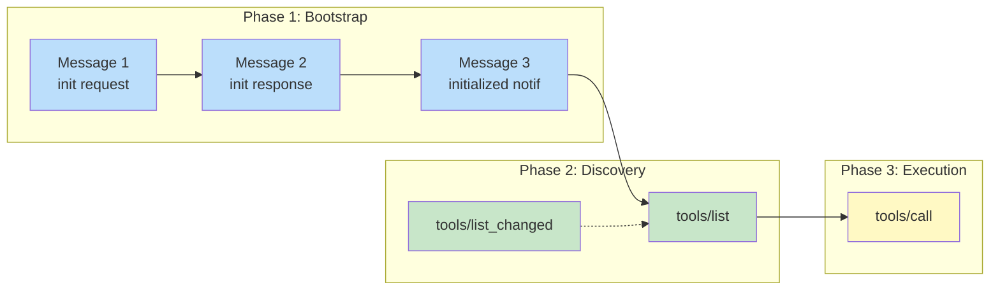
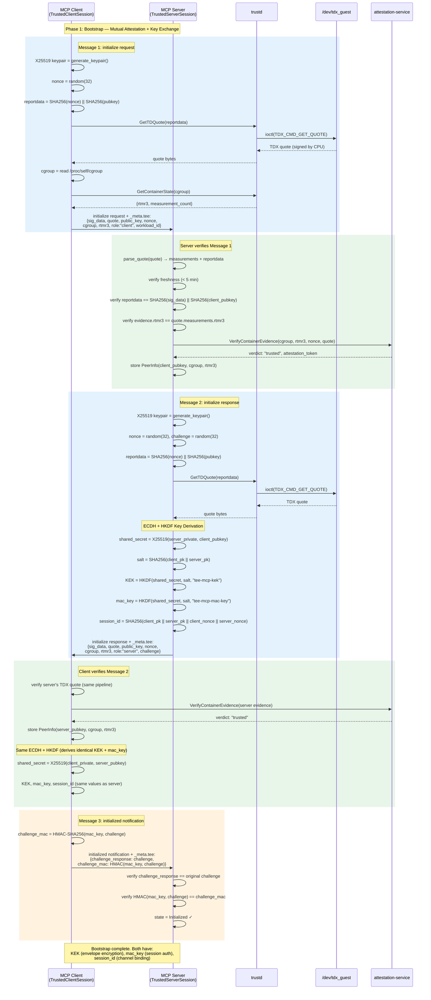
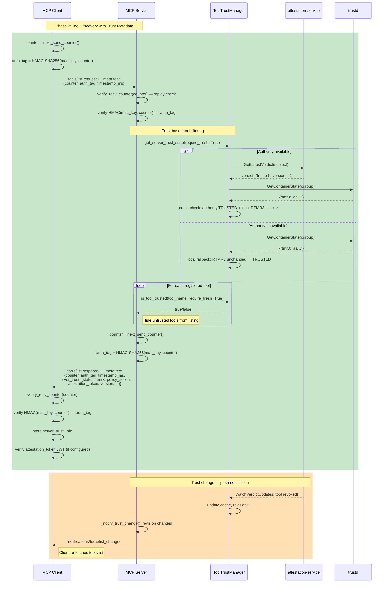
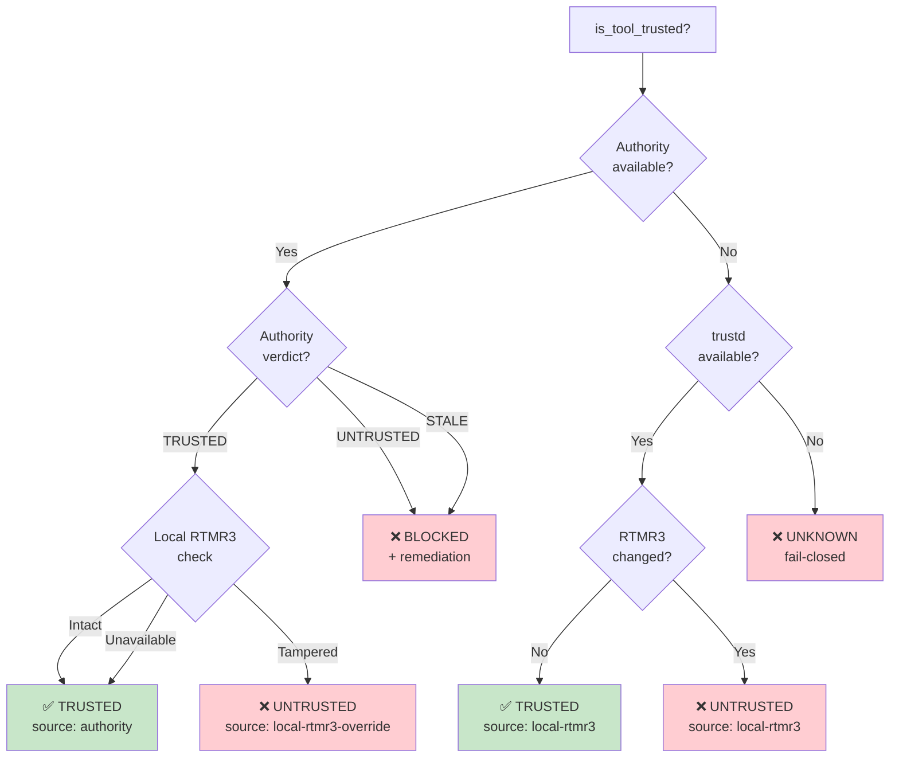
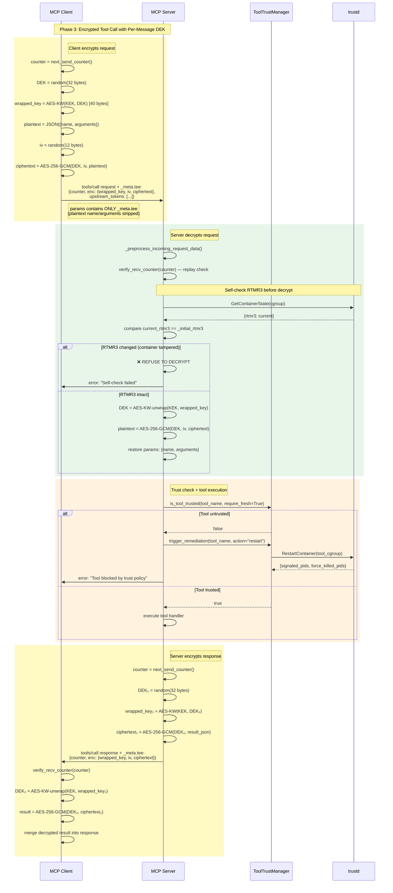
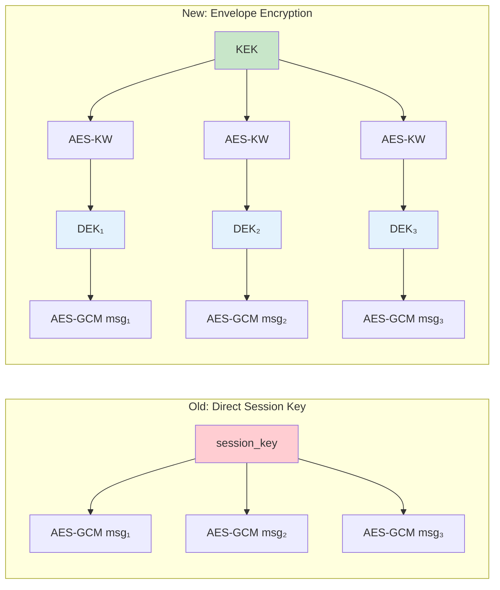
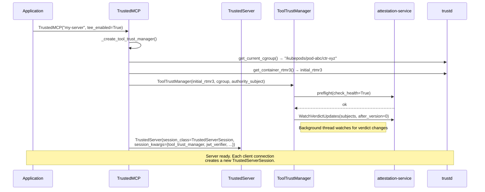
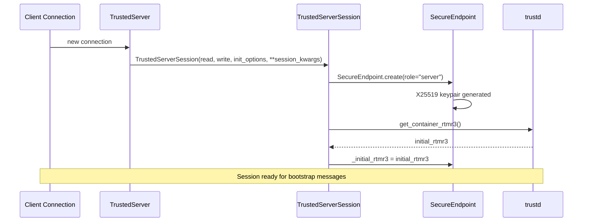
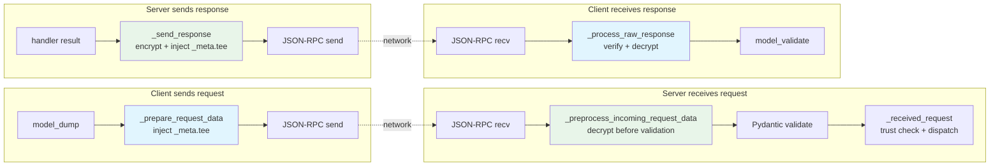

# TEE-MCP Protocol: Code-by-Code Walkthrough

## Architecture Overview

```mermaid
graph TB
    subgraph "Host (KubeVirt)"
        KV[kubevirt agent]
        AS[attestation-service<br/>gRPC]
    end

    subgraph "Trust Domain (TD VM)"
        subgraph "Container A"
            MC[MCP Client<br/>TrustedClientSession]
        end
        subgraph "Container B"
            MS[MCP Server<br/>TrustedServerSession<br/>ToolTrustManager]
        end
        TD[trustd daemon<br/>/run/trustd.sock]
        HW[/dev/tdx_guest]
    end

    MC <-->|"MCP JSON-RPC<br/>+ _meta.tee"| MS
    MC ---|Unix socket| TD
    MS ---|Unix socket| TD
    TD ---|ioctl| HW
    TD ---|vsock| KV
    MS -.->|"gRPC: verify_mcp_evidence<br/>get_latest_verdict<br/>watch_verdict_updates"| AS

    style MC fill:#e1f5fe
    style MS fill:#e8f5e9
    style TD fill:#fff3e0
    style AS fill:#fce4ec
    style HW fill:#f3e5f5
```

**Key design**: MCP Client and Server are **unprivileged**. All hardware access (TDX quotes, RTMR3) goes through **trustd** via Unix socket. The **attestation-service** provides centralized policy verdicts via gRPC.

---

## Protocol Phases

The protocol has three phases, each using a different envelope type:



| Phase | Envelope Type | Security | Wire Format |
|-------|--------------|----------|-------------|
| Bootstrap (Messages 1-3) | `create_bootstrap_envelope` | TDX quote + X25519 key, plaintext | `{sig_data, quote, public_key, nonce, ...}` |
| Discovery (tools/list) | `create_session_envelope` | HMAC(mac_key, counter), no encryption | `{counter, auth_tag, timestamp_ms, server_trust}` |
| Execution (tools/call) | `create_encrypted_envelope` | Per-message DEK + AES Key Wrap + AES-256-GCM | `{counter, enc: {wrapped_key, iv, ciphertext}}` |

---

## Phase 1: Bootstrap (Messages 1-3)

### Full Sequence



### Why Each Step Exists

| Step | Purpose |
|------|---------|
| `reportdata = SHA256(nonce) \|\| SHA256(pubkey)` | Binds the nonce AND public key into the hardware-signed quote. Prevents key substitution. |
| TDX quote via trustd | Hardware proof of code identity (MRTD, RTMR0-3). Unprivileged MCP can't forge. |
| Authority verification | Centralized policy check: is this container image approved? Is it revoked? |
| ECDH → HKDF → KEK + mac_key | Forward-secret key derivation. Ephemeral keys = past sessions safe if long-term key leaks. |
| Challenge + HMAC (Message 3) | Proves client derived the same KEK via ECDH. Costs ~1μs vs ~100ms for another TDX quote. |

### Code Walkthrough: Bootstrap

#### Endpoint Creation

When `TrustedClientSession.__init__` runs (`client/trusted_session.py:146`), it creates an `SecureEndpoint`:

```python
# client/trusted_session.py:148
self._endpoint = SecureEndpoint.create(role="client")
```

`SecureEndpoint.create()` (`secure_channel.py:301`) generates a fresh X25519 keypair:

```python
keypair = x25519.generate_keypair()    # cryptography library
return cls(
    private_key=keypair.private_key,
    public_key=keypair.public_key,
    public_key_bytes=x25519.export_public_key(keypair.public_key),  # 32 raw bytes
    role=role,
)
```

**Why X25519?** Forward secrecy — each session uses new ephemeral keys. If a long-term key leaks, past sessions stay safe. X25519 is also the fastest standardized ECDH curve (~50μs per exchange).

On the server side, `TrustedServerSession.__init__` (`server/trusted_session.py:152`) does the same but also captures the initial RTMR3 for later self-check:

```python
self._endpoint = SecureEndpoint.create(role="server")
# Capture initial RTMR3 for self-check before decrypt
initial = get_container_rtmr3()
if initial != bytes(48):
    self._endpoint._initial_rtmr3 = initial
```

**Why capture initial RTMR3?** Before decrypting any tool call, the server re-reads its RTMR3 from trustd and compares. If the container's code changed (e.g., injected malicious binary), RTMR3 differs and the server **refuses to decrypt**. This catches supply-chain attacks after session establishment.

#### Message 1: Client Sends Initialize

`TrustedClientSession.initialize()` (`client/trusted_session.py:159`) sends the initialize request. The `_prepare_request_data` hook (`client/trusted_session.py:228`) intercepts:

```python
if method == "initialize":
    tee_dict = create_bootstrap_envelope(self._endpoint, workload_id=self._workload_id)
    inject_tee(request_data, tee_dict, params_level=True)
    self._init_nonce_by_request[request_id] = base64.b64decode(tee_dict["sig_data"])
```

**Why save the nonce?** After the server responds, `_process_raw_response` needs the client's original nonce to compute `session_id = SHA256(client_pk || server_pk || client_nonce || server_nonce)`. Without saving it, the binding material is lost.

`create_bootstrap_envelope` (`tee_envelope.py:100`) generates the nonce and TDX quote:

```python
nonce = secrets.token_bytes(NONCE_SIZE)    # 32 random bytes
evidence = endpoint.create_attestation(nonce)
envelope = {**evidence.to_dict(), "sig_data": base64.b64encode(nonce).decode()}
```

`create_attestation` (`secure_channel.py:530`) binds the nonce + public key into the TDX quote:

```python
reportdata = _bind_nonce_and_key(peer_nonce, self.public_key_bytes)
# = SHA256(nonce) || SHA256(pubkey) = 64 bytes (fills TDX reportdata exactly)
quote = generate_quote(reportdata)  # → trustd → /dev/tdx_guest
```

**Why `SHA256(nonce) || SHA256(pubkey)`?** TDX reportdata is exactly 64 bytes. Hashing separately provides: (1) nonce binding — quote tied to this message, (2) key binding — attacker can't substitute their key, (3) domain separation — prevents length-extension attacks.

The quote generation chain (`tdx.py:132` → `trustd_client.py:92`):

```python
# tdx.py: generate_quote()
client = get_trustd_client()
return client.get_td_quote(padded_reportdata)

# trustd_client.py: get_td_quote()
result = self._call("GetTDQuote", {"report_data": b64_data})  # Unix socket JSON
return base64.b64decode(result["td_quote"])
```

**Why Unix socket?** ~0.1ms latency vs ~1-5ms for gRPC. New connection per call, no reconnection logic — simple and reliable.

#### Server Verifies Message 1

`TrustedServerSession._received_request` matches `InitializeRequest` (`server/trusted_session.py:250`) and calls `_verify_client_bootstrap`:

```python
client_binding = self._verify_client_bootstrap(params)
```

`_verify_client_bootstrap` (`server/trusted_session.py:536`) calls `verify_bootstrap_envelope`:

```python
valid, error = verify_bootstrap_envelope(
    self._endpoint, tee_dict, peer_role="client", allowed_rtmr3=allowed_rtmr3,
)
if valid:
    self._client_attested = True
    client_init_nonce = base64.b64decode(tee_dict["sig_data"])
    client_pubkey_raw = base64.b64decode(tee_dict["public_key"])
    return (client_init_nonce, client_pubkey_raw)
```

Inside `verify_bootstrap_envelope` (`tee_envelope.py:130`), the verification pipeline runs:

```python
evidence = AttestationEvidence.from_dict(tee_dict)
result = endpoint.verify_peer_attestation(evidence, expected_nonce=nonce, ...)
```

`verify_peer_attestation` (`secure_channel.py:556`) calls `_verify_attestation_evidence` which performs **6 checks**:

1. **Freshness**: `age < MAX_AGE_MS` (5 minutes) — prevents replay of old quotes
2. **Parse**: `parse_quote(evidence.quote)` — validates binary quote structure
3. **RTMR3 consistency**: `evidence.rtmr3 == quote.measurements.rtmr3` — metadata matches hardware
4. **Reportdata binding**: `quote.reportdata == SHA256(nonce) || SHA256(pubkey)` — the critical check
5. **Authority verification**: `_verify_quote_via_authority()` → gRPC to attestation-service
6. **RTMR3 allowlist**: pattern matching against operator-configured list

#### Message 2: Server Responds

`_build_server_bootstrap` (`server/trusted_session.py:577`) generates the server's evidence + challenge:

```python
bootstrap_challenge = self._endpoint.generate_bootstrap_challenge()
tee_dict = create_bootstrap_envelope(self._endpoint, challenge=bootstrap_challenge)
```

Then establishes the ECDH session:

```python
if client_binding is not None:
    client_init_nonce, client_pubkey_raw = client_binding
    server_init_nonce = base64.b64decode(tee_dict["sig_data"])
    self._endpoint.establish_session(client_pubkey_raw, client_init_nonce, server_init_nonce)
```

`establish_session` (`secure_channel.py:332`) performs ECDH + HKDF:

```python
# 1. ECDH shared secret
shared_secret = x25519.compute_shared_secret(self.private_key, peer_pub)

# 2. Canonical ordering (client first, server second)
if self.role == "client":
    client_pk, server_pk = self.public_key_bytes, peer_pubkey_raw
else:
    client_pk, server_pk = peer_pubkey_raw, self.public_key_bytes

# 3. HKDF → KEK + mac_key
keys = x25519.derive_keys(shared_secret, client_pk, server_pk)
self.kek = keys.kek        # 32 bytes, for AES Key Wrap
self.mac_key = keys.mac_key  # 32 bytes, for HMAC-SHA256

# 4. session_id for channel binding
binding = client_pk + server_pk + client_init_nonce + server_init_nonce
self.session_id = hashlib.sha256(binding).digest()
```

**Why canonical ordering?** Both sides must compute identical keys. Client always first ensures `HKDF(salt=SHA256(client_pk || server_pk))` is the same regardless of who computes it.

**Why include nonces in session_id?** Prevents cross-session relay: an attacker replaying Message 1 from Session A in Session B would produce a different session_id (different nonces), and all subsequent messages would fail.

#### Message 3: Challenge-Response

After `_process_raw_response` establishes the session on the client side, `initialize()` sends Message 3 (`client/trusted_session.py:216`):

```python
if self._pending_challenge is not None:
    await self._send_initialized_with_challenge(self._pending_challenge)
```

`_send_initialized_with_challenge` (`client/trusted_session.py:362`):

```python
challenge_mac = self._endpoint.create_challenge_mac(challenge)
# = HMAC-SHA256(mac_key, challenge) via x25519.hmac_challenge()

tee_dict = {
    "challenge_response": base64.b64encode(challenge).decode(),
    "challenge_mac": base64.b64encode(challenge_mac).decode(),
}
```

**Why HMAC instead of another TDX quote?** TDX quote costs ~100ms (hardware). HMAC costs ~1μs. The client's identity was already proven by Message 1's TDX quote. Message 3 only needs to prove the client derived the same ECDH keys — HMAC with the shared `mac_key` is sufficient and 100,000x faster.

The server verifies in `_verify_challenge_response` (`server/trusted_session.py:623`):

```python
challenge = self._endpoint.consume_bootstrap_challenge()  # one-time use
response_bytes = base64.b64decode(challenge_response_b64)
if response_bytes != challenge:
    return False  # echo mismatch

# Verify HMAC proves shared key derivation
return self._verify_challenge_mac(challenge, challenge_mac_b64)
```

**Why `consume_bootstrap_challenge` is one-time?** After consumption, it's `None`. Replay of Message 3 has no pending challenge to verify against — defense-in-depth.

---

## Phase 2: Discovery (tools/list)



### Two-Tier Trust Decision



### Code Walkthrough: tools/list

#### Client Sends tools/list

`_prepare_request_data` (`client/trusted_session.py:243`) creates a session envelope:

```python
elif method == "tools/list":
    if self._endpoint is not None and self._endpoint.session_id is not None:
        tee_dict = create_session_envelope(self._endpoint)
        inject_tee(request_data, tee_dict, params_level=True)
```

`create_session_envelope` (`tee_envelope.py:246`):

```python
counter = endpoint.next_send_counter()
auth_tag = endpoint.create_session_auth(counter)
envelope = {
    "counter": counter,
    "auth_tag": base64.b64encode(auth_tag).decode(),
    "timestamp_ms": int(time.time() * 1000),
}
```

**Why no TDX quote or encryption for tools/list?** Tool listings are names and descriptions — not sensitive. The HMAC auth tag proves the message came from the established session. Generating a TDX quote per listing would add ~100ms for no security benefit.

#### Server Filters Tools by Trust

`_send_response` (`server/trusted_session.py:413`) handles tools/list specially:

```python
if is_tools_list and self._endpoint is not None:
    trust_info = self._tool_trust_manager.get_server_trust_state(require_fresh=True)
    trust_metadata = trust_info.to_dict()

    # Filter: only include trusted tools
    for tool in typed_tools:
        tool_trust_info = self._tool_trust_manager.get_tool_trust_state(tool_name, require_fresh=True)
        if self._tool_trust_manager.is_tool_trusted(tool_name, trust_info=tool_trust_info):
            filtered_tools.append(tool)
```

**Why filter at listing time?** The client should never see revoked tools. This is the first defense. The second defense is `is_tool_trusted()` at `tools/call` time (belt and suspenders).

#### ToolTrustManager: Two-Tier Decision

`get_subject_trust_state` (`tool_trust.py:498`) implements the two-tier logic:

```python
# Tier 2: try authority
trust_state = self._query_authority(normalized_subject, now_ms)

if trust_state is not None:
    if trust_state.status == TrustVerdict.TRUSTED:
        # Cross-check with local RTMR3
        trust_state = self._cross_check_with_local(trust_state, normalized_subject, now_ms)
else:
    # Tier 1: authority unavailable, local RTMR3 via trustd
    trust_state = self._local_trust_fallback(normalized_subject, now_ms)
```

`_check_local_integrity` (`tool_trust.py:359`) queries trustd:

```python
state = trustd.get_container_state(cgroup)
current_rtmr3 = state.get("rtmr3", "")
if self._initial_rtmr3_hex and subject == self._authority_subject:
    if current_rtmr3 and current_rtmr3 != self._initial_rtmr3_hex:
        return False, "RTMR3 changed since session start", current_rtmr3
return True, "", current_rtmr3
```

**Why two tiers?** Authority provides policy (admin revocation, version requirements) but is a remote service that can be unavailable. trustd provides local RTMR3 integrity checks via Unix socket (~0.1ms, always available). With both, the server can operate even during authority outages.

#### Trust Change Notification

When the attestation-service pushes a verdict update, `_on_authority_update` (`tool_trust.py:299`) increments the revision:

```python
self._cached_info_by_subject[subject] = trust_state
self._revision += 1  # ← triggers notification
```

`_notify_trust_change` (`server/trusted_session.py:373`) detects the change:

```python
revision = int(getattr(self._tool_trust_manager, "revision", 0))
if revision > self._last_notified_trust_revision:
    self._last_notified_trust_revision = revision
    await self.send_tool_list_changed()  # → client re-fetches tools/list
```

---

## Phase 3: Execution (tools/call)

### Envelope Encryption Detail



### Why Envelope Encryption (Not Direct Session Key)



| Property | Direct Session Key | Envelope Encryption |
|----------|-------------------|---------------------|
| Key compromise | All messages exposed | Only one message exposed |
| Nonce reuse | Catastrophic (auth key recovery) | Harmless (different DEK) |
| KEK touches plaintext | Yes | Never |
| Per-message isolation | None | Full |

### Code Walkthrough: tools/call

#### Client Encrypts Request

`_prepare_request_data` (`client/trusted_session.py:249`) encrypts the tool call:

```python
elif method == "tools/call":
    if self._endpoint.kek is not None:
        tee_dict = create_encrypted_envelope(
            self._endpoint, params_dict,
            upstream_tokens=self._upstream_tokens or None,
        )
        inject_tee(request_data, tee_dict, params_level=True)
        request_data["params"] = {"_meta": params_dict["_meta"]}  # strip plaintext
```

**Why strip plaintext params?** After encryption, tool name and arguments are inside `enc.ciphertext`. Leaving them also in plaintext defeats the purpose.

`create_encrypted_envelope` (`tee_envelope.py:176`):

```python
counter = endpoint.next_send_counter()
plaintext = {k: v for k, v in payload.items() if k != "_meta"}
plaintext_bytes = json.dumps(plaintext, separators=(",", ":")).encode()
enc_payload = endpoint.wrap_and_encrypt(plaintext_bytes)
envelope = {"counter": counter, "enc": enc_payload.to_dict()}
```

`wrap_and_encrypt` (`secure_channel.py:488`) performs envelope encryption:

```python
def wrap_and_encrypt(self, plaintext: bytes) -> EnvelopePayload:
    return envelope_encrypt(self.kek, plaintext)
```

`envelope_encrypt` (`crypto/envelope.py:65`):

```python
dek = secrets.token_bytes(DEK_SIZE)          # fresh 32-byte DEK per message
wrapped_key = aes_key_wrap(kek, dek)         # AES-KW: KEK wraps DEK → 40 bytes
result = aes.encrypt(dek, plaintext)         # AES-256-GCM(DEK, payload)
return EnvelopePayload(wrapped_key=wrapped_key, iv=result.nonce, ciphertext=result.ciphertext)
```

**Why per-message DEK?** If two messages accidentally reuse the same 12-byte AES-GCM nonce (birthday bound ~2^48), it's harmless — different DEKs mean different keystreams. With a shared session key, nonce reuse is catastrophic.

#### Server Decrypts Request

The pre-validation hook `_preprocess_incoming_request_data` (`server/trusted_session.py:194`) decrypts BEFORE schema validation:

```python
decrypted_params, valid, error = verify_encrypted_envelope(
    self._endpoint, tee_dict, self_check_rtmr3=True,
)
# Restore plaintext fields for schema validation
params.update(decrypted_params)
```

**Why a preprocess hook?** MCP schema validation expects `params.name` and `params.arguments`. But those fields are encrypted. We must decrypt before validation so the standard dispatch works. The `_preprocess_incoming_request_data` hook fires before Pydantic validation.

`verify_encrypted_envelope` (`tee_envelope.py:196`) performs:

```python
# 1. Replay protection
endpoint.verify_recv_counter(counter)

# 2. Self-check RTMR3 (server only)
if self_check_rtmr3 and enc_dict:
    current_rtmr3 = get_container_rtmr3()
    if current_rtmr3 != initial_rtmr3:
        return None, False, "Self-check failed: container integrity changed"

# 3. Unwrap DEK and decrypt
enc_payload = EnvelopePayload.from_dict(enc_dict)
plaintext_bytes = endpoint.unwrap_and_decrypt(enc_payload)
decrypted = json.loads(plaintext_bytes)
```

`unwrap_and_decrypt` (`secure_channel.py:502`):

```python
def unwrap_and_decrypt(self, payload: EnvelopePayload) -> bytes:
    return envelope_decrypt(self.kek, payload)
```

`envelope_decrypt` (`crypto/envelope.py:80`):

```python
dek = aes_key_unwrap(kek, payload.wrapped_key)  # recover DEK from wrapped key
return aes.decrypt(dek, payload.iv, payload.ciphertext)  # AES-256-GCM decrypt
```

**Why self-check before decrypt?** Even if an attacker compromises the container after session establishment, the self-check catches it. The server reads its current RTMR3 from trustd (which reads from the kernel). If RTMR3 changed (malicious code loaded), the server refuses to decrypt — the attacker never sees the client's sensitive tool arguments.

#### Tool Trust Check

After decryption, `_received_request` (`server/trusted_session.py:260`) checks trust BEFORE executing:

```python
case types.CallToolRequest():
    # Fast-path: check trust BEFORE tool execution
    trust_info = self._tool_trust_manager.get_tool_trust_state(tool_name, require_fresh=True)
    if not self._tool_trust_manager.is_tool_trusted(tool_name, trust_info=trust_info):
        self._tool_trust_manager.trigger_remediation(tool_name, action=trust_info.policy_action)
        await responder.respond(ErrorData(code=INVALID_REQUEST, message="Tool blocked"))
        return
```

`trigger_remediation` (`tool_trust.py:607`) kills compromised containers:

```python
target_cgroup = cgroup_from_subject(subject)
result = trustd.restart_container(target_cgroup)  # SIGTERM then SIGKILL
self.invalidate()  # clear trust cache
```

**Why check trust after decryption?** The trust check is ~1ms (cache hit) vs ~10ms (envelope decryption). Checking after decryption avoids decrypting messages for tools that will be blocked anyway. But the `_preprocess` hook must decrypt first for schema validation — so the check is belt-and-suspenders: schema validation needs the plaintext, trust check prevents execution.

#### Server Encrypts Response

`_send_response` (`server/trusted_session.py:466`):

```python
if self._endpoint.kek is not None:
    tee_dict = create_encrypted_envelope(self._endpoint, result_dict)
    result_dict = {"_meta": {"tee": tee_dict}}
```

Same `create_encrypted_envelope` → `wrap_and_encrypt` → `envelope_encrypt` path. A fresh DEK₂ is generated for the response — completely independent from the request's DEK₁.

#### Client Decrypts Response

`_process_raw_response` (`client/trusted_session.py:292`):

```python
if is_tool_call and self._endpoint.kek is not None:
    decrypted, valid, error = verify_encrypted_envelope(self._endpoint, server_tee)
    if decrypted is not None:
        result = {**result, **decrypted}
```

**Why no self-check on the client side?** The self-check is a server-side defense. The server holds the KEK and decrypts sensitive tool arguments — it must prove its own integrity. The client initiates requests — if compromised, the attacker already has access to whatever the client knows.

---

## Component Interactions

### Startup (Server)



### Per-Connection Session



---

## Wire Format Reference

### Bootstrap Envelope (Messages 1 & 2)

```json
{
  "_meta": {
    "tee": {
      "quote": "<base64 TDX quote (~600+ bytes)>",
      "public_key": "<base64 X25519 key (32 bytes)>",
      "nonce": "<base64 nonce (32 bytes)>",
      "cgroup": "/kubepods/pod-abc/container-xyz",
      "rtmr3": "a1b2c3...<96 hex chars>",
      "timestamp_ms": 1710000000000,
      "role": "client",
      "sig_data": "<base64 nonce (same as above, wire compat)>",
      "workload_id": "agent-pipeline-v2",
      "challenge": "<base64 32 bytes, Message 2 only>"
    }
  }
}
```

### Challenge Response (Message 3)

```json
{
  "_meta": {
    "tee": {
      "challenge_response": "<base64 echo of server's challenge>",
      "challenge_mac": "<base64 HMAC-SHA256(mac_key, challenge)>"
    }
  }
}
```

### Encrypted Envelope (tools/call)

```json
{
  "_meta": {
    "tee": {
      "counter": 0,
      "enc": {
        "wrapped_key": "<base64 AES-KW(KEK, DEK) = 40 bytes>",
        "iv": "<base64 AES-GCM IV = 12 bytes>",
        "ciphertext": "<base64 AES-GCM(DEK, payload) + 16-byte tag>"
      },
      "upstream_tokens": [
        {"token": "<JWT>", "role": "client", "subject": "cgroup://..."}
      ]
    }
  }
}
```

### Session Envelope (tools/list)

```json
{
  "_meta": {
    "tee": {
      "counter": 2,
      "auth_tag": "<base64 HMAC-SHA256(mac_key, counter)>",
      "timestamp_ms": 1710000001000,
      "server_trust": {
        "status": "trusted",
        "rtmr3": "a1b2c3...",
        "initial_rtmr3": "a1b2c3...",
        "cgroup": "/kubepods/pod-abc/container-xyz",
        "policy_action": "none",
        "version": 42,
        "attestation_token": "eyJ...",
        "source": "authority"
      }
    }
  }
}
```

---

## Cryptographic Primitives

| Primitive | Purpose | Where |
|-----------|---------|-------|
| X25519 ECDH | Ephemeral key agreement | Bootstrap (establish_session) |
| HKDF-SHA256 | Derive KEK + mac_key from shared secret | `crypto/x25519.py:derive_keys()` |
| AES Key Wrap (RFC 3394) | Wrap per-message DEK with KEK | `crypto/envelope.py:envelope_encrypt()` |
| AES-256-GCM | Encrypt payload with per-message DEK | `crypto/aes.py:encrypt()` |
| HMAC-SHA256 | Challenge MAC (Message 3), session auth (tools/list) | `x25519.py:hmac_challenge()`, `SecureEndpoint.create_session_auth()` |
| SHA256 | session_id binding, reportdata binding, HKDF salt | `secure_channel.py` |
| SHA384 | Virtual RTMR3 extend (TPM-style) | `tdx.py:replay_measurements()` |
| TDX Quote | Hardware-signed attestation evidence | via trustd → `/dev/tdx_guest` |

---

## BaseSession Hook Architecture

TEE logic integrates via 5 hooks in `BaseSession`, keeping MCP protocol logic unmodified:



| Hook | Called By | Used For |
|------|-----------|----------|
| `_prepare_request_data` | `ClientSession.send_request()` | Inject `_meta.tee` into outgoing requests |
| `_process_raw_response` | `ClientSession.send_request()` | Verify/decrypt server responses |
| `_finalize_request` | `ClientSession.send_request()` | Cleanup per-request state |
| `_preprocess_incoming_request_data` | `BaseSession._receive_loop()` | Decrypt encrypted tools/call before schema validation |
| `_on_request_validation_error` | `BaseSession._receive_loop()` | Cleanup TEE state on validation failure |

---

## Code Walkthrough: trustd

### Architecture

trustd is the **privileged daemon** inside the TD VM. MCP processes are unprivileged and communicate with trustd over a Unix socket at `/run/trustd.sock`.

`TrustdClient` (`trustd_client.py:34`) uses newline-delimited JSON:

```python
class TrustdClient:
    def _call(self, method: str, params: dict) -> dict:
        request = json.dumps({"method": method, "params": params}) + "\n"
        sock = socket.socket(socket.AF_UNIX, socket.SOCK_STREAM)
        sock.connect(self._socket_path)
        sock.sendall(request.encode())
        # Read newline-delimited response
        response_buffer = b""
        while b"\n" not in response_buffer:
            chunk = sock.recv(65536)
            response_buffer += chunk
        response = json.loads(response_buffer.split(b"\n", 1)[0])
        return response.get("result", {})
```

**Why Unix socket with JSON, not gRPC?** ~0.1ms latency (vs ~1-5ms gRPC), zero dependencies (stdlib only), new connection per call (no reconnection logic).

### Operations

| Method | Purpose | Called By |
|--------|---------|-----------|
| `GetTDQuote(report_data)` | Generate TDX quote | `create_attestation()` via `generate_quote()` |
| `GetContainerState(cgroup)` | Per-container virtual RTMR3 | Self-check, `_check_local_integrity()` |
| `RestartContainer(cgroup)` | Kill compromised container | `trigger_remediation()` |
| `Ping()` | Health check | `TrustdClient.ping()` |

### Virtual RTMR3

TDX hardware has 4 RTMR registers for the **entire TD**. But a TD may run multiple containers. trustd maintains **per-cgroup** measurement chains using TPM-style extend: `RTMR3_new = SHA384(RTMR3_old || measurement_digest)` for each binary loaded in the container. This decouples measurement granularity from the TD boundary — the key innovation for per-container attestation.

---

## Code Walkthrough: attestation-service

### Role

The attestation-service is a **centralized gRPC verifier**. It provides:

1. **Quote verification**: Validates TDX quote signatures, TCB level, revocation status — things MCP can't check locally without Intel's QVE library.
2. **Policy verdicts**: Admin-driven trust decisions (approve/revoke containers).
3. **Watch streams**: Real-time push notifications when verdicts change.

### Client Integration

`AttestationAuthorityClient` (`attestation_authority_client.py:68`) connects via gRPC:

```python
class AttestationAuthorityClient:
    @classmethod
    def from_env(cls):
        address = os.environ.get("TEE_MCP_ATTESTATION_SERVICE_ADDR")
        if not address:
            return None  # not configured = authority disabled
        return cls(address, tls_enabled=_env_bool("TEE_MCP_ATTESTATION_TLS"))
```

Quote verification during bootstrap (`attestation_authority_client.py:282`):

```python
def verify_mcp_evidence(self, *, cgroup_path, rtmr3, nonce, quote, quote_report_data, public_key_bytes):
    pubkey_hash = hashlib.sha256(public_key_bytes).hexdigest()
    request = VerifyRequest(
        cgroup_path=cgroup_path,
        rtmr3=rtmr3.hex(),
        report_data=quote_report_data.hex(),
        td_quote=quote,
        container_image=f"__mcp_pubkey_sha256__:{pubkey_hash}",
    )
    response = rpc(request, timeout=self._timeout_s)
    return AuthorityEvidenceResult(verdict=..., attestation_token=...)
```

**Why `__mcp_pubkey_sha256__`?** The authority uses `container_image` as an identity field. In MCP, identity is the SHA256 hash of the X25519 public key — content-addressed, no registry needed.

### Watch Stream for Real-Time Revocation

`start_watch` (`attestation_authority_client.py:363`) runs in a background thread:

```python
def _run():
    while not stop_event.is_set():
        stream = rpc(WatchVerdictUpdatesRequest(subjects, after_version=cursor))
        for update in stream:  # blocks until next push
            verdict = to_authority_verdict(update)
            cursor = max(cursor, verdict.version)
            on_update(verdict)  # → ToolTrustManager._on_authority_update
        # Stream broke → reconnect after 1s
        time.sleep(reconnect_s)
```

**Why `after_version` cursor?** Resume token. If the stream disconnects and reconnects, it tells the server "I've seen version N, give me N+1 onward." No missed updates.
