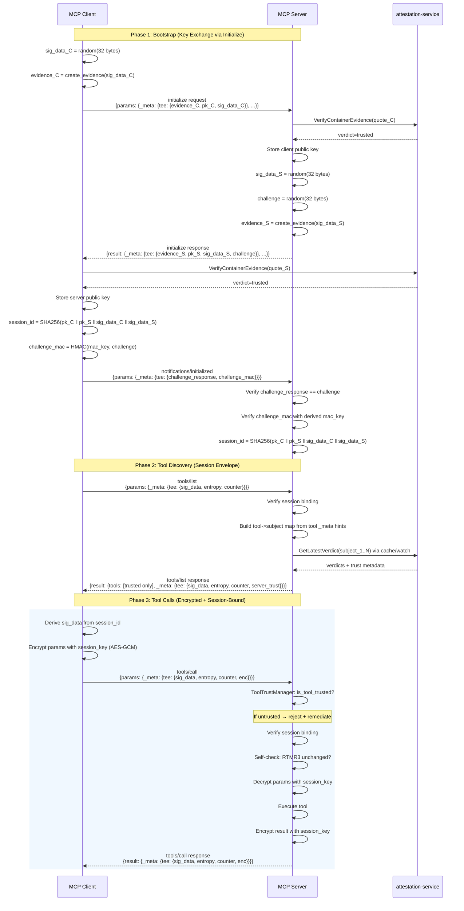
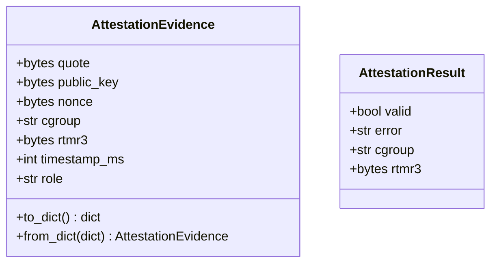
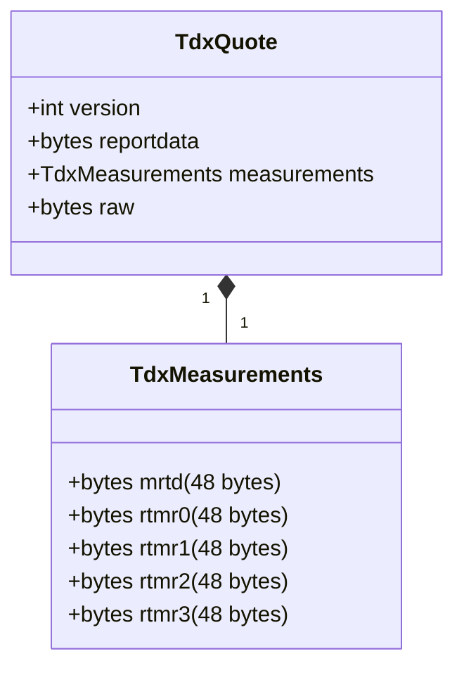
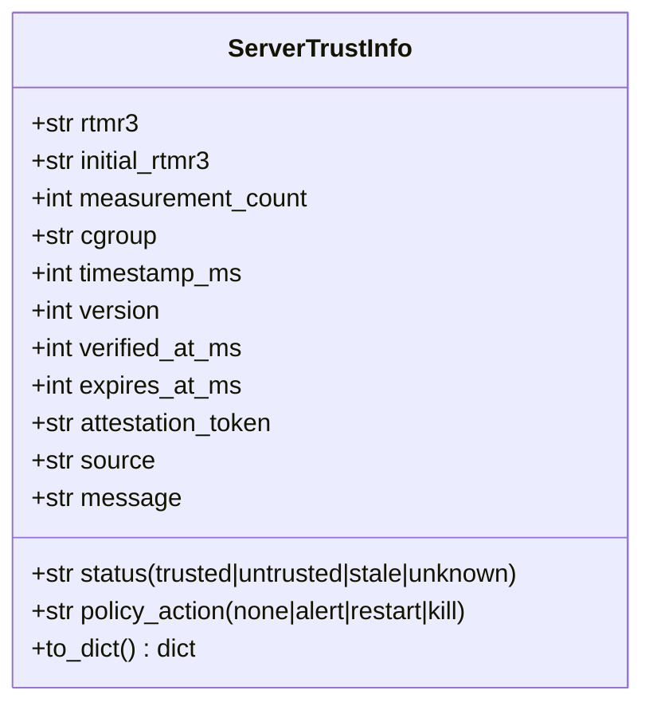
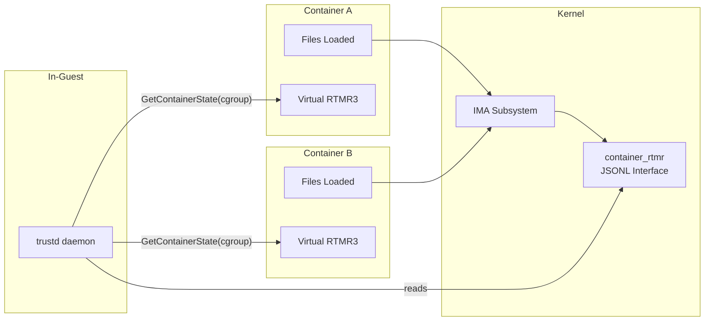
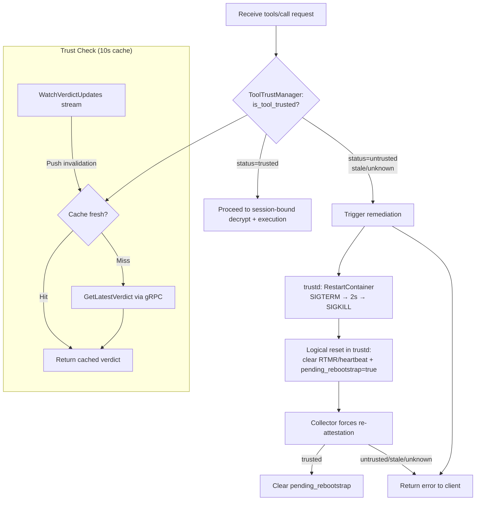
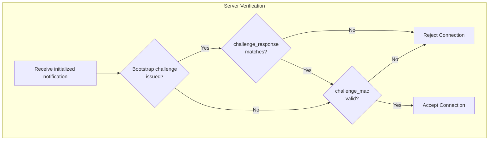
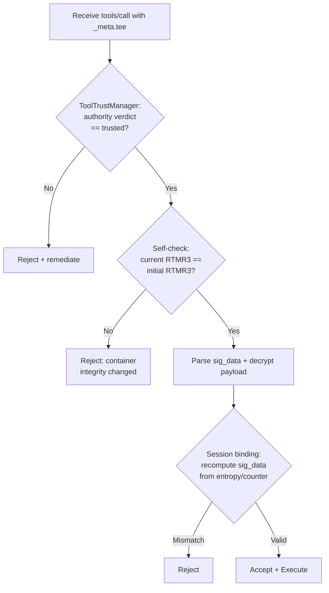
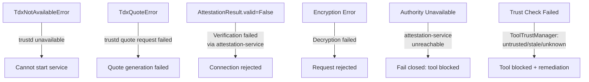

# TEE-MCP Protocol Specification

Hardware-attested, encrypted communication for MCP with mutual trust.

## Overview

TEE-MCP extends the Model Context Protocol with Intel TDX (Trust Domain Extensions) attestation, enabling mutual verification between MCP Client and MCP Server.

**Key Design**: Bootstrap attestation happens only during `initialize`. The `initialize` exchange carries TDX quote evidence and bootstraps a shared session; `tools/list` carries lightweight session-bound envelopes with trust metadata and performs **per-tool** trust filtering by authority subject; `tools/call` carries only session-bound AES-GCM encryption plus freshness metadata. There is no second quote exchange after bootstrap.

## Architecture

```mermaid
graph TB
    subgraph "MCP Client"
        CLIENT_TEE[TDX TEE]
        CLIENT_APP[Agent Orchestrator]
        CLIENT_RTMR[RTMR3: Client Container]
    end

    subgraph "MCP Server"
        SERVER_TEE[TDX TEE]
        SERVER_APP[Tool Provider]
        SERVER_RTMR[RTMR3: Server Container]
        TTM[ToolTrustManager]
    end

    subgraph "In-Guest Privileged"
        TRUSTD[trustd daemon]
        TDX[/dev/tdx_guest]
        IMA[IMA securityfs]
    end

    subgraph "Centralized Verifier"
        AS[attestation-service]
    end

    CLIENT_APP <-->|"Session-bound AES-GCM"| SERVER_APP
    CLIENT_TEE <-.->|"TDX Quotes on<br/>initialize only"| SERVER_TEE
    TTM -.->|"GetLatestVerdict<br/>WatchVerdictUpdates"| AS
    CLIENT_APP -.->|"Unix socket"| TRUSTD
    SERVER_APP -.->|"Unix socket"| TRUSTD
    TRUSTD --> TDX
    TRUSTD --> IMA
    SERVER_APP -.->|"VerifyContainerEvidence"| AS
```

## Trust Model

| Party | Role | Protects | Verifies |
|-------|------|----------|----------|
| **MCP Client** | `"client"` | Data flow, tool execution integrity | MCP Server attestation |
| **MCP Server** | `"server"` | Sensitive operations, tool access | MCP Client attestation |
| **attestation-service** | Centralized Verifier | Quote verification, policy enforcement | TDX quotes from both parties |
| **trustd** | Privileged Daemon | TDX hardware access, IMA measurements | Container RTMR3 state |
| **ToolTrustManager** | Trust Gate | Tool execution authorization | attestation-service verdicts |

Implementation note:
- `ToolTrustManager` is server-scoped and shared across sessions (created by `TrustedMCP`), so session teardown must not close the shared manager.

## Protocol Flow

### Three-Phase Flow

TEE-MCP integrates attestation into the MCP message flow via `_meta.tee`. The `initialize` exchange performs the only quote verification in the protocol. After bootstrap, `tools/list` and `tools/call` use session-bound envelopes derived from the established session keys.



### Skip Rules

TEE attestation is **skipped** for all methods except:
- `initialize` — bootstrap key exchange (plaintext + evidence)
- `tools/list` — session envelope with trust metadata (no TDX quote)
- `tools/call` — full evidence + encryption

All other methods (`ping`, `resources/read`, `prompts/get`, notifications, etc.) pass through without TEE processing.

Error responses (`ErrorData`) do not carry `_meta.tee`.

### Liveness via sig_data

`sig_data` has two phases:
- Bootstrap (`initialize`): random 32-byte nonce bound in quote reportdata.
- Post-bootstrap (`tools/call`, `tools/list`): `sig_data = HMAC(session_id, entropy ‖ counter)`.

This keeps bootstrap as Background-Check and post-bootstrap traffic as session-bound freshness.

## Formal Protocol Specification

### Notation

| Symbol | Definition |
|--------|-----------|
| `E_X(n)` | Create attestation evidence from party X binding nonce n. `reportdata = H(n) \|\| H(pk_X)` |
| `V(E, n)` | Verify peer evidence E against expected nonce n (quote verification via attestation-service + reportdata binding + freshness check) |
| `AES_ENC(k, m)` | AES-256-GCM encryption of m with key k (produces ciphertext with appended 16-byte auth tag) |
| `AES_DEC(k, c)` | AES-256-GCM decryption of c with key k |
| `H(x)` | SHA-256(x) |
| `HMAC_k(m)` | HMAC-SHA256 with key k over message m |
| `Q(rd)` | TDX `generate_quote(reportdata=rd)` — hardware-signed attestation (via trustd daemon) |
| `r <-$- S` | r sampled uniformly at random from set S |
| `\|\|` | Concatenation |
| `BE_64(x)` | 64-bit big-endian encoding of integer x |

### Bootstrap Protocol (3 messages)

The bootstrap uses the Background-Check Model (RFC 9334): the server issues a verifier-chosen challenge in message 2, and the client proves it completed the same bootstrap by returning the challenge plus an HMAC over that challenge using the derived session `mac_key`.

```
Message 1 (Client -> Server): initialize request
  sd_C <-$- {0,1}^256
  E_C = E_{pk_C}(sd_C)
      reportdata = H(sd_C) || H(pk_C)
      Q(reportdata) -> TDX quote binding nonce and key
  Send: {method: "initialize",
         _meta.tee: {E_C, pk_C, sd_C [, workload_id]}}

Message 2 (Server -> Client): initialize response
  V(E_C, sd_C) -> verify client evidence via attestation-service
  Store pk_C as peer public key
  ch <-$- {0,1}^256              (bootstrap challenge: verifier-chosen nonce)
  sd_S <-$- {0,1}^256
  E_S = E_{pk_S}(sd_S)
      reportdata = H(sd_S) || H(pk_S)
  Send: {result: ...,
         _meta.tee: {E_S, pk_S, sd_S, challenge: ch}}

Message 3 (Client -> Server): notifications/initialized
  V(E_S, sd_S) -> verify server evidence via attestation-service
  Store pk_S as peer public key
  session_id = H(pk_C || pk_S || sd_C || sd_S)
  mac = HMAC_{mac_key}(ch)
  Send: {method: "notifications/initialized",
         _meta.tee: {challenge_response: ch, challenge_mac: mac}}

Server on receiving Message 3:
  Verify challenge_response matches issued challenge
  Verify challenge_mac with mac_key derived from bootstrap
  session_id = H(pk_C || pk_S || sd_C || sd_S)
  Initialize counters: counter_S = 0, peer_counter_S = 0
```

### Tool Discovery Protocol (tools/list)

After bootstrap, `tools/list` uses lightweight session envelopes — no TDX quote, only session-bound sig_data for freshness and trust metadata from the centralized authority. Visibility is enforced **per tool subject** (not global all-or-nothing).

```
Request (Client -> Server):
  epsilon <-$- {0,1}^256
  c = counter_C++
  sd = HMAC_{session_id}(epsilon || BE_64(c))
  Send: {method: "tools/list",
         _meta.tee: {sd, epsilon, c, timestamp_ms}}

Server processing:
  Check session binding: recompute sd from epsilon/c
  Check: c >= peer_counter_S
  Build tool->subject map from tool _meta subject hints
    -> _meta.tee.subject / _meta.tee.authority_subject / _meta.tee.tool_subject
    -> _meta.attestation.subject
    -> fallback keys: _meta.subject / _meta.cgroup / _meta.cgroup_path
  ToolTrustManager.update_tool_subjects(map)
    -> watch subjects = default subject + mapped tool subjects
  For each tool:
    trust_i = ToolTrustManager.get_tool_trust_info(tool_name, require_fresh=True)
    if trust_i.status == "trusted": keep tool
    else: hide tool
  Update: peer_counter_S = c + 1

Response (Server -> Client):
  epsilon' <-$- {0,1}^256
  c' = counter_S++
  sd_resp = HMAC_{session_id}(epsilon' || BE_64(c'))
  Send: {result: {tools: [...],
         _meta: {tee: {sd_resp, epsilon', c', timestamp_ms,
                       server_trust: {status, rtmr3, policy_action, ...}}}}}

Client verification:
  Check session binding: recompute sd_resp from epsilon'/c'
  Check: c' >= peer_counter_C
  Cache server_trust_info for transparency/UX
  Update: peer_counter_C = c' + 1
```

Notes:
- If a tool has no subject hint in `_meta`, server falls back to the default authority subject (`TEE_MCP_ATTESTATION_SUBJECT` or `cgroup://<server-cgroup>`).
- `server_trust` in `tools/list` is a server trust snapshot for transparency; enforcement remains server-side.
- Trusted servers advertise `tools.listChanged=true` and may send `notifications/tools/list_changed` when trust revision or visible-tool set changes.
- Client applications should refresh `tools/list` after `notifications/tools/list_changed`.
- Untrusted tools are hidden individually; `tools/list` is no longer global all-or-nothing.

### Per-Call Protocol (tools/call, messages 4+)

After bootstrap, both sides share `session_id`, `session_key`, and `mac_key`. Each tool call uses HMAC-derived `sig_data`, monotonic counters, and AES-256-GCM under the shared `session_key`.

The server applies three verification layers before executing a tool:
1. **ToolTrustManager** — authority verdict check (fail-closed)
2. **Self-check** — RTMR3 unchanged since session start
3. **Session binding** — HMAC-derived `sig_data` + AES-GCM decryption

```
Request (Client -> Server):
  epsilon_i <-$- {0,1}^256
  c_i = counter_C++
  sd = HMAC_{session_id}(epsilon_i || BE_64(c_i))
  ct = AES_ENC(session_key, params)
  Send: {method: "tools/call",
         _meta.tee: {sd, epsilon_i, c_i,
                     enc: {nonce: aes_nonce, ciphertext: ct}}}

Server processing — Layer 1: ToolTrustManager (fast-path, ~0ms cached):
  trust_info = ToolTrustManager.get_tool_trust_info(tool_name, require_fresh=True)
  If trust_info.status != "trusted":
      Trigger remediation via trustd RestartContainer(cgroup)
      trustd marks subject pending_rebootstrap and emits lifecycle events
      (remediation_begin/remediation_done/remediation_failed)
      Keep fail-closed until a fresh trusted verdict is observed
      Return error: "Tool blocked by trust policy"
      STOP

Server processing — Layer 2: Preprocess (schema validation):
  Encrypted tools/call has only _meta in params (name/arguments are inside
  ciphertext). The preprocess hook (_preprocess_incoming_request_data) decrypts
  early so JSON-RPC schema validation can proceed normally.
  params = AES_DEC(session_key, ct)
  Restore plaintext fields (name, arguments) into request params.

Server processing — Layer 3: Session binding:
  Check: c_i >= peer_counter_S   (monotonic counter check)
  sd' = HMAC_{session_id}(epsilon_i || BE_64(c_i))
  Verify: sd' == sd              (session binding check)
  Self-check: current_RTMR3 == initial_RTMR3 (refuse decrypt if changed)
  Execute tool call with params
  Update: peer_counter_S = c_i + 1

Response (Server -> Client):
  epsilon_j <-$- {0,1}^256
  c_j = counter_S++
  sd_resp = HMAC_{session_id}(epsilon_j || BE_64(c_j))
  ct' = AES_ENC(session_key, result)
  Send: {result: ...,
         _meta.tee: {sd_resp, epsilon_j, c_j,
                     enc: {nonce: aes_nonce', ciphertext: ct'}}}

Client verification:
  Check: c_j >= peer_counter_C   (monotonic counter check)
  sd_resp' = HMAC_{session_id}(epsilon_j || BE_64(c_j))
  Verify: sd_resp' == sd_resp    (session binding check)
  result = AES_DEC(session_key, ct')
  Update: peer_counter_C = c_j + 1
```

### Security Invariants

The following invariants are maintained by the protocol. See [SECURITY_ANALYSIS.md](SECURITY_ANALYSIS.md) for complete formal analysis and proofs.

| Invariant | Property | Mechanism |
|-----------|----------|-----------|
| **INV-1** | Bootstrap evidence freshness | Every bootstrap evidence `E_X(n)` has `timestamp_ms < MAX_AGE` (5 min). |
| **INV-2** | Session binding | Post-bootstrap `sig_data` is `HMAC_{session_id}(epsilon \|\| counter)`. Only parties that completed the bootstrap can derive valid `sig_data`. |
| **INV-3** | Counter monotonicity | `c_i >= peer_counter` enforced on every message. Prevents replay and reordering within a session. Gaps allowed for pipelining. |
| **INV-4** | Key binding | `reportdata = H(nonce) \|\| H(pk_X)` in every bootstrap TDX quote. Binds the public key to the TEE identity — an attacker with a different key cannot produce matching evidence. |
| **INV-5** | Channel binding | `session_id = H(pk_C \|\| pk_S \|\| sd_C \|\| sd_S)`. Both sides must have completed the same bootstrap to derive matching session keys. |
| **INV-6** | Server self-integrity | Before decrypting, server verifies `current_RTMR3 == initial_RTMR3`. Refuses to process encrypted data if container integrity has changed. |
| **INV-7** | Authority trust gate | ToolTrustManager queries attestation-service before tool execution. Fail-closed: unknown/untrusted/stale verdicts block execution. |

## Message Formats

### Initialize Request (with `_meta.tee`)

```json
{
  "jsonrpc": "2.0",
  "id": 1,
  "method": "initialize",
  "params": {
    "protocolVersion": "2024-11-05",
    "clientInfo": {"name": "TrustedMCPClient", "version": "0.1"},
    "capabilities": {},
    "_meta": {
      "tee": {
        "quote": "base64-encoded-tdx-quote",
        "public_key": "base64-encoded-rsa-public-key",
        "nonce": "base64-encoded-nonce",
        "cgroup": "/docker/client-container-id",
        "rtmr3": "hex-encoded-48-bytes",
        "timestamp_ms": 1234567890123,
        "role": "client",
        "sig_data": "base64-encoded-32-random-bytes",
        "workload_id": "optional-workload-identity"
      }
    }
  }
}
```

### Initialize Response (with `_meta.tee`)

```json
{
  "jsonrpc": "2.0",
  "id": 1,
  "result": {
    "protocolVersion": "2024-11-05",
    "serverInfo": {"name": "TrustedMCP", "version": "0.1"},
    "capabilities": {},
    "_meta": {
      "tee": {
        "quote": "base64-encoded-tdx-quote",
        "public_key": "base64-encoded-rsa-public-key",
        "nonce": "base64-encoded-nonce",
        "cgroup": "/docker/server-container-id",
        "rtmr3": "hex-encoded-48-bytes",
        "timestamp_ms": 1234567890123,
        "role": "server",
        "sig_data": "base64-encoded-32-random-bytes",
        "challenge": "base64-encoded-32-byte-bootstrap-challenge"
      }
    }
  }
}
```

### Initialized Notification (with `_meta.tee`)

When a bootstrap challenge was received, the client sends the raw challenge plus an HMAC over that challenge using the derived session `mac_key`:

```json
{
  "jsonrpc": "2.0",
  "method": "notifications/initialized",
  "params": {
    "_meta": {
      "tee": {
        "challenge_response": "base64-encoded-challenge-bytes"
        "challenge_mac": "base64-encoded-hmac-sha256"
      }
    }
  }
}
```

When no challenge was issued, the notification is sent without `_meta.tee` (plain protocol ACK).

### Tool List Request (session envelope)

```json
{
  "jsonrpc": "2.0",
  "id": 3,
  "method": "tools/list",
  "params": {
    "_meta": {
      "tee": {
        "sig_data": "base64-encoded-session-bound-sig-data",
        "entropy": "base64-encoded-32-random-bytes",
        "counter": 0,
        "timestamp_ms": 1234567890123
      }
    }
  }
}
```

### Tool List Response (session envelope + trust metadata)

```json
{
  "jsonrpc": "2.0",
  "id": 3,
  "result": {
    "tools": [
      {"name": "sensitive_operation", "description": "...", "inputSchema": {}}
    ],
    "_meta": {
      "tee": {
        "sig_data": "base64-encoded-session-bound-sig-data",
        "entropy": "base64-encoded-32-random-bytes",
        "counter": 0,
        "timestamp_ms": 1234567890123,
        "server_trust": {
          "status": "trusted",
          "verdict": "trusted",
          "rtmr3": "hex-encoded-48-bytes",
          "initial_rtmr3": "hex-encoded-48-bytes",
          "measurement_count": 42,
          "cgroup": "/docker/server-container-id",
          "timestamp_ms": 1234567890123,
          "policy_action": "none",
          "version": 5,
          "verified_at_ms": 1234567880000,
          "expires_at_ms": 1234567980000,
          "attestation_token": "jwt-token-from-authority",
          "source": "authority",
          "message": ""
        }
      }
    }
  }
}
```

When some tool subjects are untrusted/stale/unknown, only those tools are hidden from the list.

### Tool Call Request (encrypted + session binding)

```json
{
  "jsonrpc": "2.0",
  "id": 5,
  "method": "tools/call",
  "params": {
    "_meta": {
      "tee": {
        "sig_data": "base64-encoded-session-bound-sig-data",
        "entropy": "base64-encoded-32-random-bytes",
        "counter": 1,
        "enc": {
          "nonce": "base64-aes-gcm-nonce-12-bytes",
          "ciphertext": "base64-aes-gcm-ciphertext-with-appended-tag"
        }
      }
    }
  }
}
```

When `enc` is present, the actual params (e.g., `name`, `arguments`) are inside the ciphertext. Only `_meta` remains in plaintext. The `ciphertext` field contains AES-256-GCM encrypted data with the 16-byte authentication tag appended.

### Tool Call Response (encrypted + session binding)

```json
{
  "jsonrpc": "2.0",
  "id": 5,
  "result": {
    "_meta": {
      "tee": {
        "sig_data": "base64-encoded-session-bound-sig-data",
        "entropy": "base64-encoded-32-random-bytes",
        "counter": 1,
        "enc": {
          "nonce": "base64-aes-gcm-nonce-12-bytes",
          "ciphertext": "base64-aes-gcm-ciphertext-with-appended-tag"
        }
      }
    }
  }
}
```

In responses, the same session key derived during bootstrap is reused for decryption.

## Data Structures

### Attestation Evidence



### TDX Quote Structure



### Reportdata Binding

```
┌─────────────────────────────────────────────────────────────────┐
│                    reportdata (64 bytes)                         │
├────────────────────────────────┬────────────────────────────────┤
│      SHA256(peer_nonce)        │     SHA256(my_public_key)      │
│         (32 bytes)             │          (32 bytes)            │
└────────────────────────────────┴────────────────────────────────┘
```

### Server Trust Info (from ToolTrustManager)



## Component Architecture

```mermaid
graph TB
    subgraph "MCP Client Application"
        TC[TrustedClientSession]
        TC_EP[SecureEndpoint<br/>role='client']
    end

    subgraph "MCP Server Application"
        TS[TrustedMCP]
        TS_SERVER[TrustedServer]
        TS_SESSION[TrustedServerSession]
        TS_EP[SecureEndpoint<br/>role='server']
        TTM[ToolTrustManager]
    end

    subgraph "Shared Crypto"
        AES[AES-256-GCM]
        X25519[X25519 ECDH]
        TEE_ENV[Bootstrap Envelope<br/>initialize evidence]
        SES_ENV[Session Envelope<br/>tools/list + trust metadata]
        CALL_ENV[Call Envelope<br/>tools/call session binding]
    end

    subgraph "In-Guest Daemon"
        TRUSTD[trustd<br/>Unix socket: /run/trustd.sock]
        TDX[/dev/tdx_guest]
        RTMR[IMA securityfs<br/>container_rtmr]
    end

    subgraph "Centralized Verifier"
        AS[attestation-service<br/>gRPC: VerifyContainerEvidence]
        AAC[AttestationAuthorityClient<br/>GetLatestVerdict / WatchVerdictUpdates]
    end

    TC --> TC_EP

    TS --> TS_SERVER
    TS_SERVER --> TS_SESSION
    TS_SESSION --> TS_EP
    TS_SESSION --> TTM

    TC_EP --> SES_ENV
    TC_EP --> TEE_ENV
    TC_EP --> CALL_ENV
    TS_EP --> SES_ENV
    TS_EP --> TEE_ENV
    TS_EP --> CALL_ENV
    TEE_ENV --> X25519
    CALL_ENV --> AES

    TC_EP --> TRUSTD
    TS_EP --> TRUSTD
    TRUSTD --> TDX
    TRUSTD --> RTMR

    TC_EP -.-> AAC
    TS_EP -.-> AAC
    TTM --> AAC
    AAC --> AS
```

## Per-Container RTMR3

The kernel maintains virtual RTMR3 per container via cgroup:



### RTMR3 Extension Formula

```
new_rtmr3 = SHA384(current_rtmr3 || file_digest)
```

### Kernel JSONL Format

```json
{"cgroup":"/docker/abc123","baseline":"<hex>","rtmr3":"<hex>","count":5,"measurements":[{"digest":"<hex>","file":"/usr/bin/python3"},...]}
```

## Trust Verification Flow

### ToolTrustManager: Authority Trust Gate

Before any tool execution, the server checks the centralized authority for the **requested tool's subject**. This is a fast-path gate (~0ms with cache, ~2ms on authority query).



### Session-Level: Accept/Reject on `initialized`



### Per-Call: Session-Bound Verification on Every tools/call

Every `tools/call` request and response with `_meta.tee` triggers session-binding verification.
Quote validity is established during bootstrap; runtime trust enforcement comes from `ToolTrustManager`.



**Key invariants:**
- **ToolTrustManager is ALWAYS checked first** — fail-closed authority verdict gate
- **Self-check is ALWAYS performed** — server verifies own RTMR3 before decrypting
- **Bootstrap quote verification is ALWAYS required** — runtime quotes are not used after bootstrap
- **Authority verdicts are ALWAYS required for tool execution** — unknown/untrusted/stale blocks execution

## Cache Architecture

Two active cache layers from fastest to slowest:

```
Layer 1: ToolTrustManager [10s TTL, ~0ms]
  "Is this tool's mapped subject trusted per authority?"
  → Hit: return cached verdict
  → Miss: query attestation-service GetLatestVerdict (~2ms gRPC)
  → Push: WatchVerdictUpdates stream invalidates mapped subjects on revocation

Layer 2: attestation-service VerificationResultCache [short TTL, authority-side]
  "Have we recently verified this exact VerifyContainerEvidence request?"
  → Hit: return cached response from authority
  → Miss: run full verify backend (DCAP/ITA), publish verdict, cache briefly
  → In-flight dedupe: concurrent identical requests share one verification call
```

When a subject is revoked: Layer 1 marks that subject dirty via watch update, then blocks affected tool calls until refresh succeeds. Authority continues to evaluate evidence and publish updated verdicts. Remediation restarts the container.

## API Reference

### Server: TrustedMCP

Drop-in replacement for `MCPServer` with optional TEE support.

```python
from mcp.server.trusted_mcp import TrustedMCP

# With TEE enabled (default)
mcp = TrustedMCP(
    name="secure-tools",
    tee_enabled=True,                       # Enable TEE attestation
    require_client_attestation=True,        # Require client attestation
    allowed_client_rtmr3=["abc*"],          # Client RTMR3 patterns
    port=8443,
    ssl_certfile="/etc/tee-mcp/tls/server.crt",
    ssl_keyfile="/etc/tee-mcp/tls/server.key",
)

# Without TEE (behaves like MCPServer)
mcp = TrustedMCP(name="my-server", tee_enabled=False)

# Or use MCPServer directly
from mcp.server.mcpserver import MCPServer
mcp = MCPServer("my-server")

@mcp.tool()
def sensitive_operation(data: str) -> str:
    # Only called after attestation verified (if TEE enabled)
    return process(data)

# Run server
mcp.run(transport="streamable-http")

# Properties (when TEE enabled)
mcp.tee_enabled         # bool
mcp.is_client_attested  # bool
mcp.client_cgroup       # str
# TrustedServer defaults tools.listChanged capability to true
```

### Client: TrustedClientSession

Drop-in replacement for `ClientSession` with optional TEE support. Bootstrap attestation happens during `initialize`; `tools/list` and `tools/call` carry session-bound `_meta.tee` envelopes afterward.

```python
from mcp.client.trusted_client import TrustedClientSession
from mcp.client.streamable_http import streamable_http_client
import httpx

# Standard usage (no TEE) - use regular ClientSession
from mcp.client.session import ClientSession
async with streamable_http_client("http://server:8000/mcp") as streams:
    read_stream, write_stream, get_session_id = streams
    async with ClientSession(read_stream, write_stream) as session:
        await session.initialize()
        result = await session.call_tool("my_tool", {"param": "value"})

# With TEE enabled - use TrustedClientSession
async with httpx.AsyncClient(verify="/etc/tee-mcp/tls/ca.crt") as http_client:
    async with streamable_http_client("https://server:8443/mcp", http_client=http_client) as streams:
        read_stream, write_stream, get_session_id = streams
        async with TrustedClientSession(
            read_stream, write_stream,
            tee_enabled=True,                   # Enable TEE attestation
            allowed_server_rtmr3=["abc123*"],   # Server RTMR3 patterns
        ) as session:
            await session.initialize()  # Key exchange happens here

            # Check attestation status
            if session.is_server_attested:
                print(f"Server attested: {session.server_cgroup}")
            if session.peer_verified:
                print("Peer verified via _meta.tee")

            # tools/list carries trust metadata
            tools = await session.list_tools()
            if session.server_trust_info:
                print(f"Server trust: {session.server_trust_info['status']}")

            # Every call_tool carries session-bound encryption + freshness metadata
            result = await session.call_tool("my_tool", {"param": "value"})

# Properties available after initialize()
session.tee_enabled          # bool - TEE feature enabled
session.is_server_attested   # bool - server attestation succeeded
session.peer_verified        # bool - peer verified via _meta.tee
session.server_cgroup        # str - attested server's cgroup path
session.server_rtmr3         # bytes - attested server's RTMR3 value
session.server_trust_info    # dict - latest trust info from tools/list
session.endpoint             # SecureEndpoint - for advanced operations
```

### Standalone: TrustedService (Non-MCP)

For non-MCP services (e.g., LLM inference) that need TEE attestation outside of the MCP protocol. This is a standalone utility, not integrated into the MCP session flow.

```python
from mcp.shared.trusted_service import TrustedService

service = TrustedService(role="server", allowed_client_rtmr3=["abc*"])
```

## Quote Verification Authority

All quote verification is centralized in `attestation-service` and invoked via gRPC.
Local verifier backends (DCAP, ITA) are not used in MCP — they exist only in the
attestation-service itself.

### Verification Flow

1. Parse quote and validate nonce/public-key reportdata binding locally.
2. Send evidence to `attestation-service` with `VerifyContainerEvidence`.
3. Require `verdict=trusted`; otherwise fail closed.
4. Authority may serve from its short-lived verification cache for identical requests.
5. Always enforce freshness, session binding, and RTMR3 allowlist checks.

### MCP Public Key Binding

When MCP Server calls `VerifyContainerEvidence`, it includes:
```
container_image = "__mcp_pubkey_sha256__:<sha256(public_key_pem)>"
```

This allows attestation-service to bind the MCP server's cryptographic identity to the container's attestation, enabling per-workload policy enforcement.

### Environment Variables

| Variable | Default | Description |
|----------|---------|-------------|
| `TEE_MCP_ATTESTATION_SERVICE_ADDR` | *(unset)* | gRPC endpoint for centralized quote verification authority |
| `TEE_MCP_ATTESTATION_TLS` | `false` | Enable TLS for authority gRPC channel |
| `TEE_MCP_ATTESTATION_CA_CERT` | *(unset)* | CA certificate for authority TLS |
| `TEE_MCP_ATTESTATION_CLIENT_CERT` | *(unset)* | Client certificate for authority mTLS |
| `TEE_MCP_ATTESTATION_CLIENT_KEY` | *(unset)* | Client key for authority mTLS |
| `TEE_MCP_ATTESTATION_SERVER_NAME` | *(unset)* | Override TLS server name for authority |
| `TEE_MCP_ATTESTATION_SUBJECT` | *(unset)* | Default authority subject fallback (used when tool metadata does not provide a subject hint) |

## Security Properties

| Property | Mechanism |
|----------|-----------|
| **Identity** | TDX quote contains MRTD (TD measurement) |
| **Integrity** | RTMR3 = hash chain of loaded files |
| **Freshness** | Session-bound sig_data = HMAC(session_id, entropy \|\| counter) |
| **Key Binding** | Public key hash in reportdata ties crypto to TEE |
| **Confidentiality** | Session-key AES-256-GCM after X25519 bootstrap |
| **Channel Binding** | session_id = SHA256(client_pk \|\| server_pk \|\| sd_C \|\| sd_S) |
| **Session Continuity** | Monotonic counter prevents replay/reordering |
| **Bootstrap Freshness** | Verifier-chosen nonce (challenge) for Background-Check Model |
| **Continuous Verification** | Every tools/call enforces fresh session binding plus authority verdict gating |
| **Server Self-Integrity** | RTMR3 self-check before decrypt; refuse if container integrity changed |
| **Authority Trust Gate** | ToolTrustManager evaluates per-tool mapped subject verdicts; fail-closed on non-trusted verdicts |
| **Remediation** | Untrusted verdict triggers container restart via trustd (SIGTERM → SIGKILL) |
| **Cache Security** | TTL expiry + authority watch invalidation + bootstrap evidence freshness + reportdata binding |
| **Runtime Monitoring** | RTMR3 transition detection with configurable policy |
| **Quote Verification** | Centralized authority RPC (`attestation-service` VerifyContainerEvidence) |
| **Fail Closed** | If authority unavailable or returns non-`trusted`, verification rejects |
| **Per-Workload Policy** | `AttestationPolicy` + `PolicyRegistry` for workload-specific requirements |

## Formal Security Analysis (RATS / SEAT)

TEE-MCP maps to the IETF RATS architecture (RFC 9334) as follows:

| TEE-MCP Component | RATS Role |
|---|---|
| Container running MCP code | Attester |
| `SecureEndpoint.verify_peer()` | Relying-party side verifier logic |
| `attestation-service` | Verifier Backend (quote verification, policy) |
| `TrustedServerSession` / `TrustedClientSession` | Relying Party |
| TDX quote | Evidence |
| `AttestationResult` | Attestation Result |
| `VerificationResultCache` (authority-side) | Appraisal Policy cache (centralized dedupe) |
| `ToolTrustManager` | Continuous trust evaluation (authority verdicts) |
| trustd | Attester agent (hardware/IMA access) |

### Attestation Model Classification

- **Bootstrap (initialize)**: Background-Check Model (verifier-chosen nonce)
- **Tool calls**: Session-bound encrypted channel (no fresh quote)
- **Combined**: Background-Check bootstrap plus session-bound runtime flow

### Session-Level Channel Binding

After bootstrap, both sides compute:
```
session_id = SHA256(client_pubkey_pem || server_pubkey_pem || init_sig_data_client || init_sig_data_server)
```

Subsequent sig_data is derived:
```
sig_data = HMAC-SHA256(session_id, entropy || counter_8bytes_BE)
```

### Attack Resistance

| Attack | Mitigation |
|---|---|
| Replay | Session-bound sig_data + monotonic counter |
| Diversion (Identity Crisis) | session_id binds both pubkeys |
| Relay | Bootstrap challenge + session binding |
| Runtime state change | RTMR3 self-check + ToolTrustManager + policy-driven remediation |
| Session confusion | session_id prevents cross-session relay |
| Authority unavailable | Fail-closed: unknown verdict → block execution |
| Container compromise | Authority detects RTMR3 change → untrusted verdict → remediation |

See [SECURITY_ANALYSIS.md](SECURITY_ANALYSIS.md) for the complete formal analysis.

## Error Handling



## Files

| File | Purpose |
|------|---------|
| `shared/tdx.py` | TDX quote parsing plus trustd-backed quote/state access |
| `shared/crypto/aes.py` | AES-256-GCM symmetric encryption |
| `shared/crypto/x25519.py` | X25519 key agreement + challenge MAC helpers |
| `shared/secure_channel.py` | SecureEndpoint, authority-backed attestation verification, session binding |
| `shared/attestation_authority_client.py` | gRPC client for centralized verifier authority (VerifyContainerEvidence, GetLatestVerdict, WatchVerdictUpdates) |
| `shared/attestation_policy.py` | Per-workload attestation policy framework |
| `shared/tee_envelope.py` | Bootstrap and session envelope helpers for initialize/tools/list/tools/call |
| `shared/tee_helpers.py` | _meta.tee injection/extraction helpers |
| `shared/trustd_client.py` | Unix socket client for trustd daemon (GetContainerState, GetTDQuote, RestartContainer) |
| `shared/trusted_service.py` | Standalone TEE attestation for non-MCP services |
| `client/trusted_session.py` | TrustedClientSession — bootstrap attestation + session-bound runtime envelopes |
| `client/trusted_client.py` | Re-exports TrustedClientSession |
| `server/trusted_session.py` | TrustedServerSession — bootstrap attestation + session-bound runtime envelopes |
| `server/trusted_server.py` | TrustedServer — extends Server with custom session support |
| `server/trusted_mcp.py` | TrustedMCP — extends MCPServer with TEE + ToolTrustManager |
| `server/tool_trust.py` | ToolTrustManager — authority-backed trust gate with remediation |
